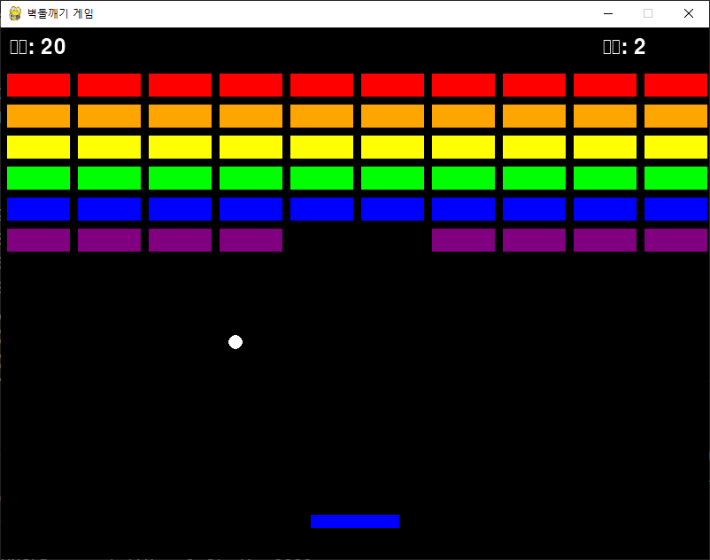

# AIOT
## AIoT 로봇 융합 스마트제조 실무
---
# 🧱 Python 벽돌깨기 게임 (Breakout Game)

Python과 Pygame을 사용하여 만든 클래식 벽돌깨기 게임입니다.


## 📸 스크린샷



## 🎮 게임 특징

- **직관적인 조작**: 키보드로 간편한 패들 조작
- **물리 엔진**: 현실적인 공 반사 시뮬레이션
- **점수 시스템**: 벽돌을 깰 때마다 점수 획득
- **생명 시스템**: 3번의 기회로 도전적인 게임플레이
- **다양한 색상**: 6가지 색상의 아름다운 벽돌 디자인
- **게임 상태 관리**: 승리/패배 조건과 재시작 기능

## 🚀 시작하기

### 필요 조건

- Python 3.7 이상
- Pygame 라이브러리

### 설치

1. 저장소를 클론합니다:
```bash
git clone https://github.com/your-username/python-breakout-game.git
cd python-breakout-game
```

2. Pygame을 설치합니다:
```bash
pip install pygame
```

### 실행

```bash
python breakout_game.py
```

## 🎯 게임 규칙

### 목표
모든 벽돌을 파괴하여 게임을 클리어하세요!

### 조작법
- **좌로 이동**: `←` (왼쪽 화살표) 또는 `A`
- **우로 이동**: `→` (오른쪽 화살표) 또는 `D`
- **게임 재시작**: `스페이스바` (게임 오버/승리 후)
- **게임 종료**: `ESC` 또는 창 닫기

### 점수 시스템
- 벽돌 파괴: **10점**
- 생명: **3개** (공이 바닥에 떨어질 때마다 -1)

## 🏗️ 코드 구조

```
breakout_game.py
├── Paddle 클래스      # 플레이어 패들 관리
├── Ball 클래스        # 공의 움직임과 충돌 처리
├── Brick 클래스       # 벽돌 객체와 상태 관리
└── Game 클래스        # 메인 게임 로직과 루프
```

### 주요 기능

#### 🏓 Paddle (패들)
- 플레이어 입력에 따른 좌우 이동
- 화면 경계 내에서의 움직임 제한
- 공과의 충돌 감지

#### ⚪ Ball (공)
- 물리학 기반 움직임 시뮬레이션
- 벽과 패들에서의 반사
- 패들 접촉 위치에 따른 반사각 조절

#### 🧱 Brick (벽돌)
- 6가지 색상으로 구성된 60개 벽돌
- 충돌 시 파괴 상태 변경
- 시각적 피드백

#### 🎮 Game (게임 관리)
- 게임 상태 관리 (플레이/게임오버/승리)
- 점수 및 생명 시스템
- 이벤트 처리 및 화면 렌더링

## 🎨 커스터마이징

### 게임 설정 변경

```python
# 게임 설정
SCREEN_WIDTH = 800      # 화면 너비
SCREEN_HEIGHT = 600     # 화면 높이
FPS = 60               # 프레임 레이트

# 난이도 조절
ball.speed = 5         # 공 속도 (높을수록 어려움)
paddle.speed = 8       # 패들 속도
lives = 3             # 시작 생명 수
```

### 색상 변경

```python
# 색상 정의 (RGB 값)
RED = (255, 0, 0)
GREEN = (0, 255, 0)
BLUE = (0, 0, 255)
# ... 원하는 색상 추가
```

## 🐛 알려진 이슈

- [ ] 공이 매우 낮은 각도로 움직일 때 무한 루프 가능성
- [ ] 고해상도 디스플레이에서의 스케일링 문제

## 🤝 기여하기

기여를 환영합니다! 다음과 같은 방법으로 참여하실 수 있습니다:

1. 이 저장소를 포크합니다
2. 새로운 기능 브랜치를 생성합니다 (`git checkout -b feature/AmazingFeature`)
3. 변경사항을 커밋합니다 (`git commit -m 'Add some AmazingFeature'`)
4. 브랜치에 푸시합니다 (`git push origin feature/AmazingFeature`)
5. Pull Request를 생성합니다

### 개발 아이디어

- [ ] 파워업 아이템 추가 (큰 패들, 멀티볼 등)
- [ ] 레벨 시스템 구현
- [ ] 사운드 효과 추가
- [ ] 하이스코어 저장 기능
- [ ] 다양한 벽돌 타입 (내구도 시스템)
- [ ] 애니메이션 효과 개선

## 📄 라이선스

이 프로젝트는 MIT 라이선스 하에 배포됩니다. 자세한 내용은 [LICENSE](LICENSE) 파일을 참조하세요.

## 👨‍💻 개발자

- **당신의 이름** - [GitHub 프로필](https://github.com/your-username)

## 🙏 감사의 말

- [Pygame](https://www.pygame.org/) 커뮤니티의 훌륭한 문서와 예제들
- 클래식 아타리 벽돌깨기 게임에서 영감을 받았습니다

---

⭐ 이 프로젝트가 도움이 되었다면 스타를 눌러주세요!
