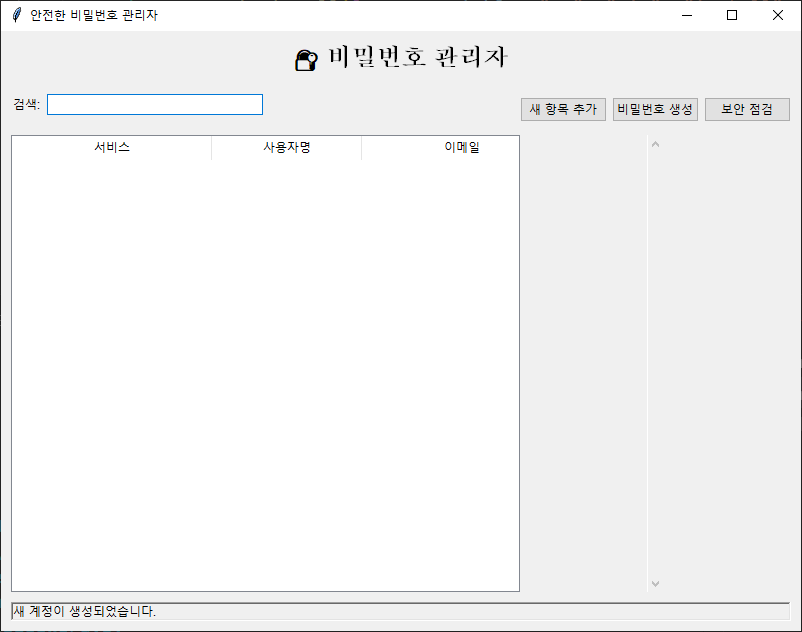

# 🔐 안전한 비밀번호 관리자 (Secure Password Manager)


> 🛡️ **개인정보 보호의 시작은 강력한 비밀번호부터**  
> 군사급 암호화로 보호되는 개인용 비밀번호 관리 솔루션

## 📖 개요

현대인은 평균적으로 100개 이상의 온라인 계정을 사용합니다. 각각에 대해 강력하고 고유한 비밀번호를 기억하는 것은 불가능에 가깝습니다. 이 프로그램은 **단 하나의 마스터 비밀번호**로 모든 계정을 안전하게 관리할 수 있도록 도와줍니다.

### ✨ 핵심 가치
- **보안**: AES-256 군사급 암호화
- **편의성**: 직관적인 사용자 인터페이스
- **프라이버시**: 모든 데이터가 로컬에 저장
- **신뢰성**: 오픈소스로 투명한 코드

## 🚀 주요 기능

### 🔒 보안 기능
- **AES-256 암호화**: 군사급 보안으로 데이터 보호
- **PBKDF2 키 유도**: 마스터 비밀번호 안전성 강화 (100,000회 반복)
- **자동 백업**: 데이터 손실 방지를 위한 백업 파일 생성
- **메모리 보호**: 클립보드 자동 삭제 (30초)
- **세션 관리**: 안전한 로그인/로그아웃 시스템

### 🛠️ 관리 기능
- **계정 관리**: 서비스명, 사용자명, 이메일, 비밀번호, 메모 저장
- **빠른 검색**: 실시간 필터링으로 원하는 계정 즉시 찾기
- **원클릭 복사**: 더블클릭으로 비밀번호 클립보드 복사
- **컨텍스트 메뉴**: 우클릭으로 빠른 작업 수행
- **정렬 및 표시**: 직관적인 테이블 형태로 정보 표시

### 🎯 보안 도구
- **비밀번호 생성기**: 
  - 4~64자 길이 설정 가능
  - 대소문자, 숫자, 특수문자 조합 선택
  - 실시간 강도 평가
- **보안 점검**:
  - 약한 비밀번호 탐지
  - 중복 비밀번호 찾기
  - 오래된 비밀번호 알림 (6개월 기준)
  - 종합 보안 리포트 제공

## 📱 스크린샷


## 💻 시스템 요구사항

### 최소 요구사항
- **운영체제**: Windows 7+ / macOS 10.12+ / Linux (GUI 지원)
- **Python**: 3.7 이상
- **메모리**: 100MB RAM
- **저장공간**: 10MB

### 권장 요구사항
- **Python**: 3.9 이상
- **메모리**: 256MB RAM
- **저장공간**: 50MB (백업 파일 포함)

## 🔧 설치 및 실행

### 1. 저장소 클론
```bash
git clone https://github.com/your-username/secure-password-manager.git
cd secure-password-manager
```

### 2. 의존성 설치
```bash
# 기본 설치
pip install -r requirements.txt

# 또는 개별 설치
pip install tkinter pyperclip cryptography
```

### 3. 프로그램 실행
```bash
python password_manager.py
```

### 🐍 requirements.txt
```txt
cryptography>=3.4.8
pyperclip>=1.8.2
```

## 📚 사용 가이드

### 🆕 첫 실행 (신규 사용자)
1. 프로그램 실행
2. **마스터 비밀번호 설정** (8자 이상 권장)
3. 비밀번호 확인 입력
4. 첫 번째 계정 정보 추가

### 🔑 기존 사용자 로그인
1. 프로그램 실행
2. 마스터 비밀번호 입력
3. 암호화된 데이터 자동 로드

### ➕ 새 계정 추가
1. **"새 항목 추가"** 버튼 클릭
2. 필수 정보 입력:
   - 서비스명 (필수)
   - 사용자명/이메일
   - 비밀번호 (직접 입력 또는 생성)
   - 메모 (선택사항)
3. **"저장"** 클릭

### 🔍 계정 검색 및 사용
- **검색**: 상단 검색창에 서비스명, 사용자명, 이메일 입력
- **비밀번호 복사**: 계정 항목 더블클릭
- **사용자명 복사**: 우클릭 → "사용자명 복사"
- **수정/삭제**: 우클릭 메뉴 사용

### 🛡️ 보안 기능 활용

#### 비밀번호 생성
1. **"비밀번호 생성"** 버튼 클릭
2. 옵션 설정:
   - 길이 (4-64자)
   - 문자 유형 선택
3. **"비밀번호 생성"** → **"복사"**

#### 보안 점검
1. **"보안 점검"** 버튼 클릭
2. 자동 분석 결과 확인:
   - ⚠️ 약한 비밀번호
   - 🔄 중복 비밀번호  
   - 📅 오래된 비밀번호
3. 취약점이 발견된 계정 업데이트

## 🔐 보안 아키텍처

### 암호화 방식
```python
# 키 유도 과정
master_password → PBKDF2-HMAC-SHA256 (100,000 iterations) → 256-bit key
                                    ↓
                              Fernet (AES-256-CBC + HMAC)
                                    ↓
                              Encrypted JSON Data
```

### 데이터 구조
```json
{
  "1": {
    "service": "Gmail",
    "username": "john.doe",
    "email": "john@gmail.com", 
    "password": "SecureP@ssw0rd123",
    "notes": "Personal email account",
    "created": "2024-01-15"
  }
}
```

### 보안 특징
- **제로 지식**: 마스터 비밀번호는 저장되지 않음
- **솔트 적용**: 레인보우 테이블 공격 방지
- **HMAC 인증**: 데이터 무결성 보장
- **로컬 저장**: 클라우드 해킹 위험 없음

## 🗂️ 파일 구조

```
secure-password-manager/
├── password_manager.py          # 메인 프로그램
├── passwords.enc               # 암호화된 비밀번호 데이터
├── passwords.enc.backup        # 자동 백업 파일
├── requirements.txt            # 의존성 목록
├── README.md                   # 프로젝트 문서
├── LICENSE                     # 라이선스
└── screenshots/                # 스크린샷 폴더
    ├── main_window.png
    ├── add_entry.png
    └── password_generator.png
```

## 🚨 보안 권고사항

### ✅ 권장사항
- **강력한 마스터 비밀번호**: 12자 이상, 대소문자+숫자+특수문자
- **정기적 백업**: `passwords.enc.backup` 파일을 안전한 장소에 보관
- **정기적 점검**: 월 1회 보안 점검 실행
- **최신 버전 유지**: 보안 업데이트 적용

### ⚠️ 주의사항
- 마스터 비밀번호 분실 시 데이터 복구 불가능
- 공용 컴퓨터에서 사용 금지
- 화면 공유 시 프로그램 종료 권장
- 바이러스 백신 프로그램과 충돌 가능성 확인

## 🔧 고급 사용법

### 데이터 백업 및 복원
```bash
# 수동 백업
cp passwords.enc my_backup_$(date +%Y%m%d).enc

# 다른 컴퓨터로 이전
# 1. passwords.enc 파일 복사
# 2. 새 컴퓨터에서 프로그램 실행
# 3. 동일한 마스터 비밀번호로 로그인
```

### 프로그램 커스터마이징
```python
# 설정 변경 가능한 부분 (password_manager.py)
CLIPBOARD_CLEAR_TIME = 30000    # 클립보드 자동 삭제 시간 (밀리초)
PASSWORD_AGE_THRESHOLD = 180    # 비밀번호 만료 기준 (일)
BACKUP_FILE_COUNT = 5           # 보관할 백업 파일 수
```

## 🐛 문제 해결

### 자주 발생하는 문제

#### 1. 라이브러리 설치 오류
```bash
# Windows
python -m pip install --upgrade pip
pip install --user cryptography pyperclip

# macOS/Linux  
python3 -m pip install --upgrade pip
pip3 install cryptography pyperclip
```

#### 2. 마스터 비밀번호 분실
- **해결 불가능**: 보안상 복구 기능 없음
- **예방책**: 마스터 비밀번호를 안전한 곳에 별도 기록

#### 3. 데이터 파일 손상
```bash
# 백업 파일로 복원
cp passwords.enc.backup passwords.enc
```

#### 4. 클립보드 복사 안됨
- **원인**: pyperclip 라이브러리 문제
- **해결**: GUI 환경에서 실행 확인, 권한 설정 검토

### 로그 확인
```python
# 디버그 모드 실행
python password_manager.py --debug
```

## 🤝 기여하기

### 기여 방법
1. **Fork** 저장소
2. **Feature Branch** 생성 (`git checkout -b feature/amazing-feature`)
3. **Commit** 변경사항 (`git commit -m 'Add amazing feature'`)
4. **Push** to Branch (`git push origin feature/amazing-feature`)
5. **Pull Request** 생성

### 개발 환경 설정
```bash
# 개발 의존성 설치
pip install -r requirements-dev.txt

# 코드 스타일 검사
flake8 password_manager.py

# 테스트 실행
python -m pytest tests/
```

### 🎯 개발 로드맵

#### v2.0 계획
- [ ] **2단계 인증**: TOTP 코드 관리
- [ ] **보안 노트**: 보안 질문/답변 저장
- [ ] **카테고리**: 계정 분류 기능
- [ ] **CSV 가져오기**: 다른 관리자에서 데이터 이전

#### v2.1 계획  
- [ ] **다국어 지원**: 영어, 한국어, 일본어
- [ ] **다크 모드**: 테마 선택 기능
- [ ] **자동 로그아웃**: 비활성 시간 후 자동 잠금
- [ ] **생체 인증**: 지문/얼굴 인식 (Windows Hello)

#### v3.0 계획
- [ ] **팀 공유**: 안전한 비밀번호 공유 기능
- [ ] **클라우드 동기화**: 암호화된 클라우드 백업
- [ ] **브라우저 확장**: 자동 로그인 지원
- [ ] **모바일 앱**: 스마트폰 연동

## 📄 라이선스

이 프로젝트는 **MIT 라이선스** 하에 배포됩니다.

```
MIT License

Copyright (c) 2024 [Your Name]

Permission is hereby granted, free of charge, to any person obtaining a copy
of this software and associated documentation files (the "Software"), to deal
in the Software without restriction, including without limitation the rights
to use, copy, modify, merge, publish, distribute, sublicense, and/or sell
copies of the Software, and to permit persons to whom the Software is
furnished to do so, subject to the following conditions:

The above copyright notice and this permission notice shall be included in all
copies or substantial portions of the Software.

THE SOFTWARE IS PROVIDED "AS IS", WITHOUT WARRANTY OF ANY KIND, EXPRESS OR
IMPLIED, INCLUDING BUT NOT LIMITED TO THE WARRANTIES OF MERCHANTABILITY,
FITNESS FOR A PARTICULAR PURPOSE AND NONINFRINGEMENT. IN NO EVENT SHALL THE
AUTHORS OR COPYRIGHT HOLDERS BE LIABLE FOR ANY CLAIM, DAMAGES OR OTHER
LIABILITY, WHETHER IN AN ACTION OF CONTRACT, TORT OR OTHERWISE, ARISING FROM,
OUT OF OR IN CONNECTION WITH THE SOFTWARE OR THE USE OR OTHER DEALINGS IN THE
SOFTWARE.
```

## 👨‍💻 개발자 정보

- **개발자**: [Lee JuHyeok]
- **이메일**: [dlrnjstlr7@naver.com]
- **GitHub**: [@LeeJuHyeok123](https://github.com/LeeJuHyeok123)
- **웹사이트**: [your-website.com](https://your-website.com)

## 🙏 감사의 말

### 오픈소스 라이브러리
- **[Cryptography](https://cryptography.io/)**: 암호화 기능 제공
- **[Tkinter](https://docs.python.org/3/library/tkinter.html)**: GUI 프레임워크
- **[Pyperclip](https://pypi.org/project/pyperclip/)**: 클립보드 관리

### 영감을 받은 프로젝트
- **KeePass**: 비밀번호 관리의 선구자
- **Bitwarden**: 현대적인 UI/UX 디자인
- **1Password**: 사용자 경험 최적화

### 커뮤니티
- **Python 커뮤니티**: 풍부한 라이브러리 생태계
- **보안 전문가들**: 암호화 모범 사례 제공
- **GitHub 기여자들**: 코드 리뷰 및 개선 제안

---

## 📞 지원 및 문의

### 🐛 버그 신고
[Issues 페이지](https://github.com/your-username/secure-password-manager/issues)에서 버그를 신고해주세요.

### 💡 기능 제안
[Discussions 페이지](https://github.com/your-username/secure-password-manager/discussions)에서 새로운 기능을 제안해주세요.

### 📧 직접 문의
보안과 관련된 민감한 문제는 [security@your-domain.com](mailto:security@your-domain.com)으로 연락해주세요.

---

⭐ **이 프로젝트가 도움이 되셨다면 스타를 눌러주세요!**

🔒 **당신의 디지털 보안, 이제 걱정하지 마세요!**
